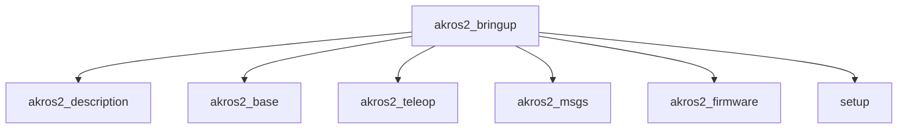
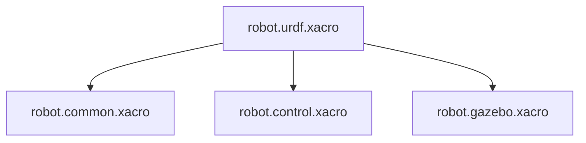
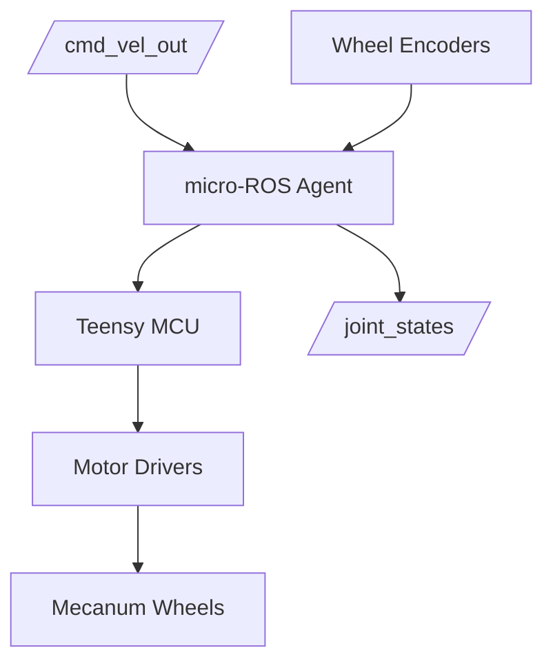

---
layout: default
---

# AKROS2 Design

AKROS2 is a ROS 2 Humble-based software stack for a mecanum-wheeled mobile robot platform. The architecture is organized into six primary packages, each handling specific aspects of robot functionality.

## System Architecture




## Package Details

### akros2_description

**Purpose:** Robot description and kinematics

**Key Components:**
- URDF/Xacro files defining robot structure
- STL mesh files for visualization
- Joint state publishing
- Robot state publishing


**URDF Structure:**


**Meshes:**
- `base_module.stl` - Robot base platform
- `navigation_module.stl` - Top navigation/sensor platform
- `wheel_lf/rf/lb/rb.stl` - Four mecanum wheels
- `ld06.stl` - LIDAR sensor
- `cam_module.stl` - Camera module
- `wireless_charger_tx.stl` - Wireless charging transmitter

**Joints:**
The robot has 4 continuous joints for the mecanum wheels:
- `joint_lf` - Left front wheel
- `joint_rf` - Right front wheel
- `joint_lb` - Left back wheel
- `joint_rb` - Right back wheel

**Topics:**
- `/joint_states` or `/req_states` - Combined joint state messages
- `/robot_description` - Robot URDF

**Launch Arguments:**
- `js_ext` (Default: `True`) - Enable external joint states (e.g., from micro-ROS)
- `js_topic` (Default: `joint_states`) - Joint states topic name

**URDF Generation:**

For visualization in Unity, convert xacro to URDF:
```bash
cd src/akros2/akros2_description
xacro urdf/robot.urdf.xacro nopath:=False > urdf/robot.urdf
```

The `nopath` argument fixes mesh paths for external applications.

**Remote Mesh Paths:**

Meshes can be referenced from remote repositories:
```bash
ros2 launch akros2_description description_launch.py \
  mesh_path:=https://github.com/adityakamath/akros_3d_assets/raw/main/akros2_mecanum/
```

### akros2_base

**Purpose:** Core robot functionality including drivers, sensors, and sensor fusion

**Key Nodes:**
- `motion_detector` - Detects robot motion from IMU data

**Launch Files:**

#### twist_mixer_launch.py
Launches the `twist_mixer` executable for command velocity mixing. No launch arguments.

#### teleop_launch.py
Launches teleoperation-related nodes:
- `joy` and `teleop_twist_joy` nodes via joy_launch.py
- `joy_mode_handler` node from akros2_teleop

**Launch Arguments:**
- `joy_config` - Controller configuration (ps4/stadia/sn30pro/steamdeck)

#### sensor_fusion_launch.py
Launches sensor fusion pipeline:
- [Madgwick Filter](https://github.com/CCNYRoboticsLab/imu_tools/tree/humble/imu_filter_madgwick) - IMU filtering
- [Extended Kalman Filter](https://docs.ros.org/en/melodic/api/robot_localization/html/state_estimation_nodes.html) - Fuses filtered IMU and wheel odometry
- `motion_detector` - Motion detection based on IMU angular velocities

**Subscribed Topics:**
- `/imu` - Raw IMU data
- `/mag` - Magnetometer data (if available)
- `/odometry` - Wheel odometry

**Published Topics:**
- `/imu/filtered` - Filtered IMU data
- `/odometry/filtered` - Fused odometry
- `/in_motion` - Motion detection status
- Transform: `odom->base_footprint`

#### laser_launch.py
Launches LIDAR packages:
- [ldlidar](https://github.com/linorobot/ldlidar) driver
- [laser_filters](https://github.com/ros-perception/laser_filters) package

**Launch Arguments:**
- `laser_filter` (Default: `True`) - Enable/disable LIDAR filter chain

#### camera_launch.py
Launches camera driver:
- [v4l2_camera](https://gitlab.com/boldhearts/ros2_v4l2_camera) node

**Launch Arguments:**
- `compose` (Default: `False`) - Run as composable container or standalone node

#### control_launch.py
Launches low-level control:
- [micro-ROS agent](https://github.com/micro-ROS/micro-ROS-Agent) - Serial communication with microcontroller (`/dev/ttyTEENSY`)

**Configuration Files:**

Located in `config/` directory:
- `camera_config.yaml` - Camera parameters
- `camera_info.yaml` - Camera calibration
- `ekf_config.yaml` - Extended Kalman Filter parameters
- `imu_filter_config.yaml` - Madgwick filter parameters
- `motion_detector_config.yaml` - Motion detection thresholds
- `laser_filter_config.yaml` - LIDAR filter chain

### akros2_teleop

**Purpose:** Robot teleoperation and command mixing

**Key Nodes:**
- `joy_mode_handler` - Subscribes to joystick, publishes Mode messages (stop/auto/teleop)
- `twist_mixer` - Mixes teleop and autonomous Twist commands based on mode
- `drive_node` - Composed multi-threaded executable running both nodes

**Supported Controllers:**
- [PS4 DualShock4](https://www.playstation.com/nl-nl/accessories/dualshock-4-wireless-controller/)
- [Google Stadia](https://stadia.google.com/controller/)
- [8BitDo SN30 Pro](https://www.8bitdo.com/sn30-pro-g-classic-or-sn30-pro-sn/)
- [Valve Steam Deck](https://store.steampowered.com/steamdeck)

**Launch Files:**

#### drive_launch.py
Main teleoperation launch file.

**Launch Arguments:**
- `joy` (Default: `True`) - Enable/disable joy-related packages
- `joy_config` (Default: `steamdeck`) - Controller mapping (ps4/stadia/sn30pro/steamdeck)
- `executor` - If True, runs `drive_node` composed executable; if False, runs nodes separately

#### joy_launch.py
Launches `joy` and `teleop_twist_joy` nodes.

**Launch Arguments:**
- `joy_config` - Controller configuration

**Mode Handler Parameters:**
- `estop_button` - E-Stop button mapping
- `auto_button` - Auto/Teleop toggle button mapping

**Twist Mixer Parameters:**
- `timer_period` (Default: 0.01s) - Update rate

**Configuration Files:**

Located in `config/` directory (per controller):

- `<controller>_mapping.md` - Button/axis mapping documentation
- `<controller>_mode_config.yaml` - Mode button mappings
- `<controller>_twist_config.yaml` - Twist command scaling

### akros2_msgs

**Purpose:** Custom message definitions

**Messages:**

#### Mode.msg
Robot operation mode status:
```
bool estop      # Emergency stop status
bool auto_t     # Autonomous mode (True) vs Teleop mode (False)
```

**Usage:**
Published by `joy_mode_handler`, consumed by `twist_mixer` to determine command routing.

### akros2_bringup

**Purpose:** System-level launch files integrating all packages

**Launch Files:**

#### bringup_launch.py
Main robot bringup launch file.

**Launch Arguments:**
- `joy_config` (Default: `steamdeck`) - Controller configuration (ps4/stadia/sn30pro/steamdeck/none)
- `desc` (Default: `True`) - Enable URDF description
- `laser` (Default: `True`) - Enable LIDAR
- `camera` (Default: `True`) - Enable camera
- `control` (Default: `True`) - Enable low-level control
- `fusion` (Default: `True`) - Enable sensor fusion
- `teleop` (Default: `True`) - Enable teleoperation
- `js_topic` (Default: `joint_states`) - Joint states topic (joint_states/req_states)
- `js_ext` (Default: `True`) - Enable external joint states (e.g., micro-ROS)

**Included Launch Files:**
- `akros2_description/description_launch.py`
- `akros2_base/laser_launch.py`
- `akros2_base/camera_launch.py`
- `akros2_base/control_launch.py`
- `akros2_base/sensor_fusion_launch.py`
- `akros2_base/teleop_launch.py`
- `akros2_base/twist_mixer_launch.py`

**Note:** Due to launch timing issues, it's recommended to launch with `control:=false camera:=false` and launch those separately in different terminals.

#### bringup_local_launch.py
Similar to `bringup_launch.py` but runs `teleop_node.py` directly instead of `teleop_launch.py`.

#### basestation_launch.py
Remote base station launch file for off-board control and visualization.

**Launch Arguments:**
- `joy_config` (Default: `steamdeck`) - Controller configuration

**Usage:**
Run on remote device while running `bringup_launch.py` on robot with `joy_config:=none`.


### akros2_firmware

The [akros2_firmware](../akros2_firmware/) package contains micro-ROS firmware for the Teensy 4.1 microcontroller. Based on [linorobot2_hardware](https://github.com/linorobot/linorobot2_hardware), it provides low-level control for mecanum drive kinematics, motor control, and sensor data acquisition.

See [akros2_firmware/README.md](../akros2_firmware/README.md) for detailed firmware documentation and setup instructions.

**Purpose:** micro-ROS firmware for Teensy 4.1 microcontroller providing low-level robot control

**Based On:** [linorobot2_hardware](https://github.com/linorobot/linorobot2_hardware) MECANUM configuration

**Hardware Platform:**

- Teensy 4.1 microcontroller
- [Teensy 4.1 expansion board](https://www.tindie.com/products/cburgess129/arduino-teensy41-teensy-41-expansion-board/)
- 4x DC motors with quadrature encoders (mecanum wheels)
- 2x Cytron MDD3A motor drivers
- 9-DOF IMU (accelerometer, gyroscope, magnetometer)

**Key Features:**

1. **Dual Transport Support**
   - Configurable serial (USB/UART, default) or native ethernet (UDP4)
   - Ethernet provides higher bandwidth and reliability vs. serial
   - Transport selected via TRANSPORT_SERIAL or TRANSPORT_ETHERNET in config

2. **ROS Domain ID Configuration**
   - Set `ROS_DOMAIN_ID` via firmware configuration
   - Enables multi-robot deployments
   - Network isolation for different robot systems

3. **Neopixel Status Indicators**
   - Visual feedback using FastLED library
   - System status display (connected, error, running)
   - Operating mode indication (stop, auto, teleop)

4. **Arduino IDE Compilation**
   - Compiles using Arduino IDE instead of PlatformIO
   - Uses modified [micro_ros_arduino](https://github.com/adityakamath/micro_ros_arduino/tree/akros2_galactic) libraries
   - Simplified development workflow

5. **Custom Message Support**
   - Mode subscriber using `akros2_msgs/Mode` message type
   - Receives operating mode commands (estop/auto/teleop)
   - Integrates with twist_mixer command routing

6. **Dual Joint State Publishing**
   - `/joint_states` - Measured wheel positions and velocities from encoders
   - `/req_states` - Required (commanded) wheel positions and velocities
   - Enables monitoring of command tracking performance

7. **Runtime PID Tuning**
   - Parameter server reads PID gains: `kp`, `ki`, `kd`, `scale`
   - No firmware recompilation needed for tuning
   - Initial values from configuration, re-applied on reconnection
   - `scale` parameter limited to [0.0, 1.0] with 0.01 step size

8. **Coordinate Frame Conversion**
   - Optional NED to ENU conversion for IMU data
   - Controlled by `ned_to_enu` boolean parameter (default: false)
   - REP-103 compliant coordinate frame handling
   - Sensor-specific conversion in IMU interface layer

**ROS 2 Interface:**

**Published Topics:**

- `/joint_states` (sensor_msgs/JointState) - Measured wheel states
- `/req_states` (sensor_msgs/JointState) - Required wheel states
- `/imu` (sensor_msgs/Imu) - Raw IMU measurements
- `/odometry` (nav_msgs/Odometry) - Wheel-based odometry

**Subscribed Topics:**

- `/cmd_vel` (geometry_msgs/Twist) - Velocity commands
- `/mode_status` (akros2_msgs/Mode) - Operating mode

**Parameters:**

- `kp` (double) - Proportional gain for PID controller
- `ki` (double) - Integral gain for PID controller
- `kd` (double) - Derivative gain for PID controller
- `scale` (double) - Global velocity scaling [0.0-1.0]
- `ned_to_enu` (bool) - Enable IMU coordinate conversion

**Mecanum Kinematics:**

The firmware implements forward and inverse kinematics for mecanum drive:

**Inverse Kinematics** (Twist → Wheel Velocities):
```
wheel_lf = (vx - vy - ωz × wheelbase) / wheel_radius
wheel_rf = (vx + vy + ωz × wheelbase) / wheel_radius
wheel_lb = (vx + vy - ωz × wheelbase) / wheel_radius
wheel_rb = (vx - vy + ωz × wheelbase) / wheel_radius
```

**Forward Kinematics** (Wheel Velocities → Odometry):
```
vx = (wheel_lf + wheel_rf + wheel_lb + wheel_rb) × wheel_radius / 4
vy = (-wheel_lf + wheel_rf + wheel_lb - wheel_rb) × wheel_radius / 4
ωz = (-wheel_lf + wheel_rf - wheel_lb + wheel_rb) × wheel_radius / (4 × wheelbase)
```

**Motor Control:**

Each motor uses a PID controller:

- Input: Required wheel velocity (from inverse kinematics)
- Feedback: Measured wheel velocity (from encoders)
- Output: PWM duty cycle to motor driver
- Update rate: Configurable (typically 50-100 Hz)

**Configuration Files:**

Primary configuration in `akros2_base_config.h`:

- Robot physical dimensions (wheelbase, wheel radius)
- Encoder counts per revolution (CPR)
- Motor driver PWM pins and channels
- IMU sensor I2C address and settings
- Network configuration (IP, domain ID)
- PID initial values
- Maximum velocities and accelerations

**Development:**

The firmware is compiled and uploaded using Arduino IDE:

1. Install Teensy support in Arduino IDE
2. Install required libraries (FastLED, micro_ros_arduino)
3. Configure robot parameters in `akros2_base_config.h`
4. Compile and upload to Teensy 4.1
5. Tune PID parameters via ROS 2 parameter server


**Communication Architecture:**
```mermaid
flowchart TD
   A["ROS 2 Host<br/>(Raspberry Pi)"]
   B["micro-ROS Agent<br/>(Serial or Ethernet)"]
   C["Teensy 4.1<br/>Microcontroller"]
   D[akros2_firmware]
   E[Mecanum Kinematics]
   F[PID Controllers (4x)]
   G[Motor Drivers Interface]
   H[Encoder Readers (4x)]
   I[IMU Interface]
   J[Motor Drivers]
   K[Encoders]
   L[IMU]

   A --> B
   B --> C
   C --> D
   D --> E
   E --> F
   F --> G
   G --> J
   F --> H
   H --> K
   D --> I
   I --> L
```

**Status Indicators:**

Neopixel LED states:

- **Red Solid** - Disconnected from micro-ROS agent
- **Green Solid** - Connected, idle
- **Green Blinking** - Connected, receiving commands
- **Blue** - Auto mode active
- **Yellow** - Teleop mode active
- **Red Blinking** - Emergency stop (estop)

See [akros2_firmware/README.md](../akros2_firmware/README.md) for complete firmware documentation.

### setup

**Purpose:** System configuration, services, and development tools

**Components:**

#### .bashrc
ROS 2 environment configuration and convenience aliases.

**Environment Variables:**
```bash
ROS_DISTRO=humble
ROS_VERSION=2
```

**Build Aliases:**
- `rosws` - Navigate to workspace
- `srs` - Source ROS setup
- `sls` - Source local setup
- `build_all` - Build all packages
- `build_only` - Build specific packages
- `build_resume` - Resume interrupted build
- `dep_install` - Install rosdep dependencies

**Launch Aliases:**
- `bringup` - Main robot bringup (minimal sensors)
- `bringup_local` - Robot bringup with local control
- `basestation` - Base station control
- `control` - Low-level control only
- `unity` - Unity ROS TCP endpoint

#### Steam Deck Desktop Apps
Desktop application shortcuts for Steam Deck usage:
- Copy `.desktop` files to `/usr/share/applications/` or `~/.local/share/applications/`

#### Services and Rules

**Services:**
- Systemd service files in `services/` directory
- Enable with: `sudo systemctl enable <service>.service`

**udev Rules:**
- Rules files in `rules/` directory
- Copy to `/etc/udev/rules.d/`
- Reload: `sudo udevadm control --reload-rules && sudo udevadm trigger`

**WSL2 Configuration:**
Update `/etc/wsl.conf` for udev service:
```
[boot]
systemd=true
command="sudo husarnet daemon restart && sudo service udev start"
```

## Data Flow

### Sensor Fusion Pipeline
```mermaid
flowchart TD
   IMU[IMU]
   Madgwick[Madgwick Filter]
   Motion[Motion Detector]
   EKF[EKF (Sensor Fusion)]
   Wheel[Wheel Odometry]
   IMU --> Madgwick
   Madgwick --> Motion
   Madgwick --> EKF
   Motion --> EKF
   Wheel --> EKF
   EKF --> Odometry[/odometry/filtered/]
```

### Teleoperation Flow
```mermaid
flowchart TD
    Controller[Controller]
    Joy[Joy Node]
    Mode[Mode Handler]
    Mixer[Twist Mixer]
    MicroROS[micro-ROS Agent]
    TEENSY[/dev/ttyTEENSY]
    Controller --> Joy
    Joy --> Mode
    Mode -- "/mode_status" --> Mixer
    Joy -- "/joy_teleop/cmd_vel" --> Mixer
    Mixer -- "/cmd_vel_out" --> MicroROS
    MicroROS --> TEENSY
```

### Control Flow


## Hardware Integration

### Microcontroller Communication
- **Interface:** micro-ROS over serial (`/dev/ttyTEENSY`)
- **Direction:** Bidirectional
  - **To MCU:** `/cmd_vel_out` commands
  - **From MCU:** `/joint_states`, `/imu`, `/odometry`

### Sensors
- **LIDAR:** LD06 (via ldlidar driver)
- **Camera:** USB camera (via v4l2_camera)
- **IMU:** On-board IMU (via micro-ROS)
- **Wheel Encoders:** Integrated with motors (via micro-ROS)

### Actuators
- **4x Mecanum Wheels** with independent motor control

## Development Workflow

### Building
```bash
# Install dependencies
rosws && dep_install

# Build all packages
build_all

# Build specific package
build_only akros2_base

# Source workspace
sls
```

### Testing Individual Subsystems

**Description Only:**
```bash
ros2 launch akros2_description description_launch.py
```

**Sensor Fusion:**
```bash
ros2 launch akros2_base sensor_fusion_launch.py
```

**Teleoperation:**
```bash
ros2 launch akros2_teleop drive_launch.py joy_config:=steamdeck
```

**Control:**
```bash
ros2 launch akros2_base control_launch.py
```

### Full System Launch

**On Robot:**
```bash
# Recommended: Launch without camera and control
bringup

# Separate terminal for control
control

# Separate terminal for camera (if needed)
ros2 launch akros2_base camera_launch.py
```

**On Base Station:**
```bash
basestation
```

## Configuration Management

### Controller Configurations
Located in `akros2_teleop/config/`:
- `ps4_*` - PS4 DualShock4
- `stadia_*` - Google Stadia
- `sn30pro_*` - 8BitDo SN30 Pro
- `steamdeck_*` - Valve Steam Deck

### Sensor Configurations
Located in `akros2_base/config/`:
- IMU filtering parameters
- EKF fusion parameters
- Motion detection thresholds
- Camera parameters and calibration
- LIDAR filter chains

### System Configuration
Located in `setup/`:
- ROS environment variables
- Build and launch aliases
- Development tool shortcuts

## Dependencies

### ROS 2 Packages
`robot_state_publisher`
`joint_state_publisher`
`imu_filter_madgwick`
`robot_localization`
`laser_filters`
`v4l2_camera`
`micro_ros_agent`
`joy`
`teleop_twist_joy`
`ldlidar`

## Platform Support

**Tested On:**
- Raspberry Pi 4 (4GB/8GB)
- Raspberry Pi Zero 2 W
- Valve Steam Deck (Ubuntu 22.04 via Distrobox)
- WSL2 (partial support)

**Operating System:**
- Ubuntu 22.04 LTS (primary)

**ROS 2 Distribution:**
- Humble Hawksbill

## Recommended Setup

1. Clone setup to `~/Setup`
2. Append `.bashrc` contents to `~/.bashrc`
3. Copy udev rules to `/etc/udev/rules.d/`
4. Build workspace with `build_all`
5. Test individual subsystems before full launch
6. Launch robot with `bringup` and control with `control` in separate terminals


## Notes

- Launch `control` and `camera` separately due to timing issues
- Use `js_ext:=True` when micro-ROS firmware is running
- Steam Deck requires Distrobox with Ubuntu 22.04 container
