# 1. Overview

AKROS2 is a ROS 2 Humble-based software stack for a mecanum-wheeled mobile robot platform. The architecture is organized into six primary packages, each handling specific aspects of robot functionality.

## 1.1 Key Capabilities

- **Holonomic Drive Control** - Four-wheeled mecanum platform with independent motor control
- **Sensor Fusion** - IMU and wheel odometry fusion using Extended Kalman Filter
- **Multi-Controller Support** - PS4, Google Stadia, 8BitDo SN30 Pro, and Steam Deck controllers
- **micro-ROS Integration** - Low-level control via Teensy 4.1 microcontroller
- **Modular Architecture** - Independent packages for customization and extension
- **Distributed Deployment** - Support for multi-device setups with remote control and visualization

---

# 2. System Architecture

The AKROS2 system consists of multiple interconnected components forming a complete robot control stack:

<div align="center">
  
</div>

## 2.1 Architecture Overview

The system follows a layered architecture:

1. **Hardware Layer** - Teensy 4.1 microcontroller running micro-ROS firmware, motors, sensors
2. **Communication Layer** - micro-ROS agent providing ROS 2 bridge over serial/ethernet
3. **Sensing Layer** - Raw sensor data from IMU, encoders, LIDAR, camera
4. **Fusion Layer** - Madgwick filter and Extended Kalman Filter for sensor fusion
5. **Control Layer** - Command mixing, twist multiplexing, mode management
6. **Visualization Layer** - Robot state publishing, URDF description

## 2.2 Component Relationships

- **akros2_firmware** (Teensy) publishes raw sensor data (`/imu`, `/odometry`, `/joint_states`)
- **akros2_base** fuses sensors into `/odometry/filtered` and `/imu/filtered`
- **akros2_teleop** mixes teleop and autonomous commands based on mode
- **akros2_description** provides robot model for visualization tools (RViz2, Foxglove)
- **akros2_bringup** orchestrates all components with configurable launch arguments

## 2.3 Data Flow

The system processes data through three primary pipelines:

1. **Sensor Fusion Pipeline** - Raw IMU/odometry → Filtered orientation/position
2. **Teleoperation Flow** - Joystick input → Mode selection → Command mixing
3. **Control Flow** - Velocity commands → Inverse kinematics → Motor PWM

Detailed diagrams for each pipeline are provided in their respective sections below.

---

# 3. Core Components

## 3.1 Robot Description (akros2_description)

**Purpose:** Provides URDF/Xacro models defining the robot's physical structure, kinematics, and visualization meshes.

### 3.1.1 URDF Structure

<div align="center">
  
</div>

### 3.1.2 Components

#### Meshes
- `base_module.stl` - Robot base platform
- `navigation_module.stl` - Top navigation/sensor platform
- `wheel_lf.stl`, `wheel_rf.stl`, `wheel_lb.stl`, `wheel_rb.stl` - Four mecanum wheels
- `ld06.stl` - LIDAR sensor
- `cam_module.stl` - Camera module
- `wireless_charger_tx.stl` - Wireless charging transmitter

#### Joints
- `joint_lf` - Left front wheel (continuous, revolute)
- `joint_rf` - Right front wheel (continuous, revolute)
- `joint_lb` - Left back wheel (continuous, revolute)
- `joint_rb` - Right back wheel (continuous, revolute)

### 3.1.3 Topics

#### Published
  - `/robot_description` (std_msgs/String) - Robot URDF

#### Subscribed
  - `/joint_states` or `/req_states` (sensor_msgs/JointState) - Joint state messages for visualization

### 3.1.4 Launch Files

#### description_launch.py

Launches robot state publisher and optionally joint state publisher.

**Launch Arguments:**
- `js_ext` (Default: `True`) - Enable external joint states (e.g., from micro-ROS). If `False`, launches joint_state_publisher.
- `js_topic` (Default: `joint_states`) - Joint states topic name (`joint_states` for measured, `req_states` for required)

**Usage:**

```bash
ros2 launch akros2_description description_launch.py js_ext:=True js_topic:=joint_states
```

### 3.1.5 URDF Generation

For visualization in Unity or other external tools, convert xacro to URDF:

```bash
cd src/akros2/akros2_description
xacro urdf/robot.urdf.xacro nopath:=False > urdf/robot.urdf
```

The `nopath` argument fixes mesh paths for external applications.

### 3.1.6 Remote Mesh Paths

Meshes can be referenced from remote repositories:

```bash
ros2 launch akros2_description description_launch.py \
  mesh_path:=https://github.com/adityakamath/akros_3d_assets/raw/main/akros2_mecanum/
```

---

## 3.2 Base System (akros2_base)

**Purpose:** Core robot functionality including drivers, sensors, and sensor fusion.

### 3.2.1 Key Nodes

**motion_detector** - Detects robot motion from IMU angular velocity data.

### 3.2.2 Sensor Fusion Pipeline

The sensor fusion pipeline combines raw IMU and wheel odometry data to produce filtered, fused estimates:

<div align="center">
  
</div>

#### Pipeline Flow

1. Raw `/imu` data → Madgwick filter → `/imu/filtered`
2. `/imu/filtered` → motion_detector → `/in_motion` (bool)
3. `/imu/filtered` + `/odometry` → EKF → `/odometry/filtered`
4. EKF publishes `odom` → `base_footprint` transform

### 3.2.3 Launch Files

#### sensor_fusion_launch.py

Launches the sensor fusion pipeline.

**Nodes:**
- `imu_filter_madgwick_node` - Filters raw IMU data
- `motion_detector` - Detects motion based on angular velocity thresholds
- `ekf_node` - Fuses filtered IMU and wheel odometry

**Subscribed Topics:**
- `/imu` - Raw IMU data
- `/odometry` - Wheel odometry from micro-ROS

**Published Topics:**
- `/imu/filtered` - Filtered IMU data
- `/odometry/filtered` - Fused odometry
- `/in_motion` - Motion detection status (bool)

**Transform:** `odom` → `base_footprint`

**Usage:**
```bash
ros2 launch akros2_base sensor_fusion_launch.py
```

---

#### laser_launch.py

Launches LIDAR driver and optional filter chain.

**Nodes:**
- `ldlidar` driver node
- `laser_filter` node (optional)

**Launch Arguments:**
- `laser_filter` (Default: `True`) - Enable/disable LIDAR filter chain

**Usage:**
```bash
ros2 launch akros2_base laser_launch.py laser_filter:=True
```

---

#### camera_launch.py

Launches USB camera driver.

**Nodes:**
- `v4l2_camera` node

**Launch Arguments:**
- `compose` (Default: `False`) - Run as composable container or standalone node

**Usage:**
```bash
ros2 launch akros2_base camera_launch.py
```

---

#### control_launch.py

Launches micro-ROS agent for serial communication with Teensy microcontroller.

**Nodes:**
- `micro_ros_agent` - Serial communication bridge at `/dev/ttyTEENSY`

**Usage:**
```bash
ros2 launch akros2_base control_launch.py
```

---

#### teleop_launch.py

Launches teleoperation-related nodes (joy, teleop_twist_joy, joy_mode_handler).

**Launch Arguments:**
- `joy_config` (Default: `steamdeck`) - Controller configuration (`ps4`, `stadia`, `sn30pro`, `steamdeck`)

**Usage:**
```bash
ros2 launch akros2_base teleop_launch.py joy_config:=ps4
```

---

#### twist_mixer_launch.py

Launches the `twist_mixer` executable for command velocity mixing. No launch arguments.

**Usage:**
```bash
ros2 launch akros2_base twist_mixer_launch.py
```

---

### 3.2.4 Configuration Files

Located in `config/` directory:

- `camera_config.yaml` - Camera parameters
- `camera_info.yaml` - Camera calibration
- `ekf_config.yaml` - Extended Kalman Filter parameters
- `imu_filter_config.yaml` - Madgwick filter parameters
- `motion_detector_config.yaml` - Motion detection thresholds
- `laser_filter_config.yaml` - LIDAR filter chain configuration

---

## 3.3 Teleoperation (akros2_teleop)

**Purpose:** Robot teleoperation and command mixing based on operating mode.

### 3.3.1 Teleoperation Flow

<div align="center">
  
</div>

#### Flow Overview:

1. Joystick input → `joy` node → `/joy` topic
2. `/joy` → `joy_mode_handler` → `/mode_status` (Mode message)
3. `/joy` → `teleop_twist_joy` → `/joy_vel` (Twist)
4. `/joy_vel` + `/nav_vel` + `/mode_status` → `twist_mixer` → `/cmd_vel`

### 3.3.2 Key Nodes

**joy_mode_handler** - Subscribes to `/joy`, publishes `Mode` messages based on button presses.

**twist_mixer** - Mixes teleop (`/joy_vel`) and autonomous (`/nav_vel`) Twist commands based on `/mode_status`.

**teleop_node** - Composed multi-threaded executable running both nodes.

### 3.3.3 Supported Controllers

- [PS4 DualShock4](https://www.playstation.com/nl-nl/accessories/dualshock-4-wireless-controller/)
- [Google Stadia](https://stadia.google.com/controller/)
- [8BitDo SN30 Pro](https://www.8bitdo.com/sn30-pro-g-classic-or-sn30-pro-sn/)
- [Valve Steam Deck](https://store.steampowered.com/steamdeck)

### 3.3.4 Launch Files

#### teleop_launch.py

Main teleoperation launch file.

**Launch Arguments:**
- `joy_config` (Default: `steamdeck`) - Controller mapping (`ps4`, `stadia`, `sn30pro`, `steamdeck`)
- `executor` (Default: `True`) - If `True`, runs `teleop_node` composed executable; if `False`, runs nodes separately

**Nodes:**
- `teleop_node` (if executor=True) - Composed multi-threaded node
- `twist_mixer` + `joy_mode_handler` (if executor=False) - Separate nodes
- Includes `joy_launch.py`

**Topic Remappings:**
- `/teleop_vel` → `/joy_vel`
- `/auto_vel` → `/nav_vel`
- `/mix_vel` → `/cmd_vel`

**Parameters:**
- `timer_period`: `0.02` (50 Hz update rate)

**Usage:**
```bash
ros2 launch akros2_teleop teleop_launch.py joy_config:=steamdeck executor:=True
```

---

#### joy_launch.py

Launches `joy` and `teleop_twist_joy` nodes.

**Launch Arguments:**
- `joy_config` - Controller configuration

**Mode Handler Parameters:**
- `estop_button` - E-Stop button mapping
- `auto_button` - Auto/Teleop toggle button mapping

**Twist Mixer Parameter:**
- `timer_period` (Default: `0.02`) - Update rate (50 Hz)

---

### 3.3.5 Configuration Files

Located in `config/` directory (per controller):

- `<controller>_mapping.md` - Button/axis mapping documentation
- `<controller>_mode_config.yaml` - Mode button mappings
- `<controller>_twist_config.yaml` - Twist command scaling

Example files:
- `ps4_mode_config.yaml`, `ps4_twist_config.yaml`
- `stadia_mode_config.yaml`, `stadia_twist_config.yaml`
- `sn30pro_mode_config.yaml`, `sn30pro_twist_config.yaml`
- `steamdeck_mode_config.yaml`, `steamdeck_twist_config.yaml`

---

## 3.4 Messages (akros2_msgs)

**Purpose:** Custom ROS 2 message definitions.

### 3.4.1 Mode.msg

Robot operation mode status message.

```
bool estop      # Emergency stop status
bool auto_t     # Autonomous mode (True) vs Teleop mode (False)
```

**Usage:** Published by `joy_mode_handler`, consumed by `twist_mixer` to determine command routing.

---

## 3.5 System Integration (akros2_bringup)

**Purpose:** System-level launch files integrating all packages.

### 3.5.1 Launch Files

#### bringup_launch.py

Main robot bringup launch file integrating all subsystems.

**Launch Arguments:**
- `joy_config` (Default: `steamdeck`) - Controller configuration (`ps4`, `stadia`, `sn30pro`, `steamdeck`, `none`)
- `desc` (Default: `True`) - Enable URDF description
- `laser` (Default: `True`) - Enable LIDAR
- `camera` (Default: `True`) - Enable camera
- `control` (Default: `True`) - Enable low-level control (micro-ROS agent)
- `fusion` (Default: `True`) - Enable sensor fusion
- `teleop` (Default: `True`) - Enable teleoperation
- `js_topic` (Default: `joint_states`) - Joint states topic (`joint_states` or `req_states`)
- `js_ext` (Default: `True`) - Enable external joint states (from micro-ROS)

**Included Launch Files:**
- `akros2_description/description_launch.py`
- `akros2_base/laser_launch.py`
- `akros2_base/camera_launch.py`
- `akros2_base/control_launch.py`
- `akros2_base/sensor_fusion_launch.py`
- `akros2_base/teleop_launch.py`
- `akros2_base/twist_mixer_launch.py`

**Note:** Due to timing issues, it's recommended to launch with `control:=False camera:=False` and launch those separately in different terminals.

**Usage:**
```bash
ros2 launch akros2_bringup bringup_launch.py control:=False camera:=False
```

---

#### basestation_launch.py

Remote base station launch file for off-board control and visualization.

**Launch Arguments:**
- `joy_config` (Default: `steamdeck`) - Controller configuration

**Usage:** Run on remote device while running `bringup_launch.py` on robot with `joy_config:=none`.

```bash
# On robot
ros2 launch akros2_bringup bringup_launch.py joy_config:=none

# On base station
ros2 launch akros2_bringup basestation_launch.py joy_config:=steamdeck
```

---

#### mqtt_client_launch.py

Launches MQTT client for remote monitoring and control.

**Launch Arguments:**
- `broker_host` (Default: `ak-win11`) - Hostname of the MQTT broker
- `broker_port` (Default: `1883`) - Port used by the MQTT broker

**Nodes:**
- `mqtt_client` - MQTT client node

**Configuration:**
- `mqtt_client_config.yaml` - MQTT topic mappings and parameters

**Usage:**
```bash
ros2 launch akros2_bringup mqtt_client_launch.py broker_host:=localhost broker_port:=1883
```

---

# 4. Firmware Architecture (akros2_firmware)

The [akros2_firmware](../akros2_firmware/) package contains micro-ROS firmware for the Teensy 4.1 microcontroller. Based on [linorobot2_hardware](https://github.com/linorobot/linorobot2_hardware), it provides low-level control for mecanum drive kinematics, motor control, and sensor data acquisition.

See [akros2_firmware/README.md](../akros2_firmware/README.md) for complete firmware documentation and setup instructions.

## 4.1 Hardware Platform

- Teensy 4.1 microcontroller
- [Teensy 4.1 expansion board](https://www.tindie.com/products/cburgess129/arduino-teensy41-teensy-41-expansion-board/)
- 4x DC motors with quadrature encoders (mecanum wheels)
- 2x Cytron MDD3A motor drivers
- 9-DOF IMU (accelerometer, gyroscope, magnetometer)

## 4.2 Key Features

### 4.2.1 Dual Transport Support
- Configurable serial (USB/UART, default) or native ethernet (UDP4)
- Ethernet provides higher bandwidth and reliability vs. serial
- Transport selected via `TRANSPORT_SERIAL` or `TRANSPORT_ETHERNET` in config

### 4.2.2 ROS Domain ID Configuration
- Set `ROS_DOMAIN_ID` via firmware configuration
- Enables multi-robot deployments
- Network isolation for different robot systems

### 4.2.3 Neopixel Status Indicators
- Visual feedback using FastLED library
- System status display (connected, error, running)
- Operating mode indication (stop, auto, teleop)

#### LED States
- **Red Solid** - Disconnected from micro-ROS agent
- **Green Solid** - Connected, idle
- **Green Blinking** - Connected, receiving commands
- **Blue** - Auto mode active
- **Yellow** - Teleop mode active
- **Red Blinking** - Emergency stop (estop)

### 4.2.4 Arduino IDE Compilation
- Compiles using Arduino IDE instead of PlatformIO
- Uses modified [micro_ros_arduino](https://github.com/adityakamath/micro_ros_arduino) libraries
- Simplified development workflow

### 4.2.5 Custom Message Support
- Mode subscriber using `akros2_msgs/Mode` message type
- Receives operating mode commands (estop/auto/teleop)
- Integrates with twist_mixer command routing

### 4.2.6 Dual Joint State Publishing
- `/joint_states` - Measured wheel positions and velocities from encoders
- `/req_states` - Required (commanded) wheel positions and velocities
- Enables monitoring of command tracking performance

### 4.2.7 Runtime PID Tuning
- Parameter server reads PID gains: `kp`, `ki`, `kd`, `scale`
- No firmware recompilation needed for tuning
- Initial values from configuration, re-applied on reconnection
- `scale` parameter limited to [0.0, 1.0] with 0.01 step size

### 4.2.8 Coordinate Frame Conversion
- Optional NED to ENU conversion for IMU data
- Controlled by `ned_to_enu` boolean parameter (default: false)
- REP-103 compliant coordinate frame handling
- Sensor-specific conversion in IMU interface layer

## 4.3 Communication Architecture



The firmware communicates with ROS 2 via micro-ROS agent over serial (default) or ethernet.

## 4.4 Mecanum Kinematics

The firmware implements forward and inverse kinematics for mecanum drive:

**Inverse Kinematics** (Twist → Wheel Velocities):
```
wheel_lf = (vx - vy - ωz × wheelbase) / wheel_radius
wheel_rf = (vx + vy + ωz × wheelbase) / wheel_radius
wheel_lb = (vx + vy - ωz × wheelbase) / wheel_radius
wheel_rb = (vx - vy + ωz × wheelbase) / wheel_radius
```

**Forward Kinematics** (Wheel Velocities → Odometry):
```
vx = (wheel_lf + wheel_rf + wheel_lb + wheel_rb) × wheel_radius / 4
vy = (-wheel_lf + wheel_rf + wheel_lb - wheel_rb) × wheel_radius / 4
ωz = (-wheel_lf + wheel_rf - wheel_lb + wheel_rb) × wheel_radius / (4 × wheelbase)
```

## 4.5 Motor Control

Each motor uses a PID controller:

- **Input:** Required wheel velocity (from inverse kinematics)
- **Feedback:** Measured wheel velocity (from encoders)
- **Output:** PWM duty cycle to motor driver
- **Update rate:** Configurable (typically 50-100 Hz)

## 4.6 ROS 2 Interface

### 4.6.1 Published Topics

- `/joint_states` (sensor_msgs/JointState) - Measured wheel states
- `/req_states` (sensor_msgs/JointState) - Required wheel states
- `/imu` (sensor_msgs/Imu) - Raw IMU measurements
- `/odometry` (nav_msgs/Odometry) - Wheel-based odometry

### 4.6.2 Subscribed Topics

- `/cmd_vel` (geometry_msgs/Twist) - Velocity commands
- `/mode_status` (akros2_msgs/Mode) - Operating mode

### 4.6.3 Parameters

- `kp` (double) - Proportional gain for PID controller
- `ki` (double) - Integral gain for PID controller
- `kd` (double) - Derivative gain for PID controller
- `scale` (double) - Global velocity scaling [0.0-1.0]
- `ned_to_enu` (bool) - Enable IMU coordinate conversion

## 4.7 Configuration

Primary configuration in `akros2_base_config.h`:

- Robot physical dimensions (wheelbase, wheel radius)
- Encoder counts per revolution (CPR)
- Motor driver PWM pins and channels
- IMU sensor I2C address and settings
- Network configuration (IP, domain ID)
- PID initial values
- Maximum velocities and accelerations

## 4.8 Development

The firmware is compiled and uploaded using Arduino IDE:

1. Install Teensy support in Arduino IDE
2. Install required libraries (FastLED, micro_ros_arduino)
3. Configure robot parameters in `akros2_base_config.h`
4. Compile and upload to Teensy 4.1
5. Tune PID parameters via ROS 2 parameter server

---

# 5. Hardware Integration

## 5.1 Microcontroller Communication

- **Interface:** micro-ROS over serial (`/dev/ttyTEENSY`) or ethernet (UDP4)
- **Direction:** Bidirectional
  - **To MCU:** `/cmd_vel` commands, `/mode_status`
  - **From MCU:** `/joint_states`, `/req_states`, `/imu`, `/odometry`

## 5.2 Sensors

- **LIDAR:** LD06 (via ldlidar driver)
- **Camera:** USB camera (via v4l2_camera)
- **IMU:** On-board IMU (via micro-ROS firmware)
- **Wheel Encoders:** Integrated with motors (via micro-ROS firmware)

## 5.3 Actuators

- **4x Mecanum Wheels** with independent motor control via Cytron MDD3A drivers

## 5.4 Control Flow

<div align="center">
  
</div>

#### Flow Overview

1. Joystick/Nav → Twist commands → `/cmd_vel`
2. `/cmd_vel` → Teensy firmware → Inverse kinematics
3. Wheel velocities → PID controllers → Motor PWM
4. Encoders → Forward kinematics → `/odometry`
5. `/odometry` + `/imu` → Sensor fusion → `/odometry/filtered`

---

# 6. System Setup & Configuration

## 6.1 Development Tools

### 6.1.1 Bash Aliases (.bashrc)

ROS 2 environment configuration and convenience aliases.

#### Environment Variables
```bash
ROS_DISTRO=humble
ROS_VERSION=2
```

#### Build Aliases
- `rosws` - Navigate to workspace
- `srs` - Source ROS setup
- `sls` - Source local setup
- `build_all` - Build all packages
- `build_only` - Build specific packages
- `build_resume` - Resume interrupted build
- `dep_install` - Install rosdep dependencies

#### Launch Aliases
- `bringup` - Main robot bringup (minimal sensors)
- `bringup_local` - Robot bringup with local control
- `basestation` - Base station control
- `control` - Low-level control only
- `unity` - Unity ROS TCP endpoint

#### Usage

Copy setup to `~/Setup` and append to `~/.bashrc`:

```bash
cat src/akros2/setup/.bashrc >> ~/.bashrc
source ~/.bashrc
```

---

## 6.2 Hardware Permissions

### 6.2.1 udev Rules

Located in `setup/rules/` directory:

#### 00-teensy.rules 
- Teensy board USB permissions
- Sets permissions for Teensy USB devices (vendor ID 16c0)
- Allows non-root access to Teensy serial ports

#### 50-ds4drv.rules
- PS4 DualShock4 controller permissions
- Enables HID access for PS4 controllers (vendor ID 054c)
- Prevents touchpad from being a separate input device

#### 99-i2c.rules 
- I2C device permissions
- Allows user access to I2C devices (`/dev/i2c-*`)
- Required for OLED display and other I2C peripherals

#### 99-usb-serial.rules
- USB serial device permissions
- General USB serial device permissions

#### Installation

```bash
sudo cp src/akros2/setup/rules/*.rules /etc/udev/rules.d/
sudo udevadm control --reload-rules
sudo udevadm trigger
```

#### WSL2 Configuration

Update `/etc/wsl.conf` for udev service:
```
[boot]
systemd=true
command="sudo service udev start"
```

---

## 6.3 System Services

### 6.3.1 OLED Display Service

#### oled.service
- Systemd service for Raspberry Pi OLED display
- Script: `setup/oled.py`

#### Purpose 
- Displays system information on SSD1306 128x32 OLED display
- CPU usage, memory, IP address
- Fan control for cooling hat
- RGB LED effects

#### Dependencies
- `Adafruit_SSD1306` library
- `smbus` for I2C communication
- `PIL` (Pillow) for image rendering

#### Installation:

```bash
sudo cp src/akros2/setup/services/oled.service /etc/systemd/system/
sudo systemctl enable oled.service
sudo systemctl start oled.service
```

---

## 6.4 Steam Deck Integration

The Steam Deck integration provides desktop application shortcuts and shell scripts for running ROS 2 tools within a Distrobox Ubuntu container.

### 6.4.1 Desktop Applications

Located in `setup/steamdeck_desktop/desktop_apps/`:

- `ubuntu.desktop` - Launch Ubuntu container terminal
- `stop_ubuntu.desktop` - Stop Ubuntu container
- `basestation.desktop` - Launch AKROS2 base station
- `rviz2.desktop` - Launch RViz2 visualization
- `rqt.desktop` - Launch RQt tools
- `foxglove.desktop` - Launch Foxglove Studio

### 6.4.2 Shell Scripts

Located in `setup/steamdeck_desktop/shell_scripts/`:

- `basestation.sh`, `basestation_app.sh` - Base station launch
- `rviz2.sh`, `rviz2_app.sh` - RViz2 launch
- `rqt.sh`, `rqt_app.sh` - RQt launch
- `foxglove_app.sh` - Foxglove launch

### 6.4.3 Icons

Located in `setup/steamdeck_desktop/icons/` - Application icons for desktop shortcuts

### 6.4.4 Installation

Copy desktop files to applications directory:

```bash
# System-wide installation
sudo cp src/akros2/setup/steamdeck_desktop/desktop_apps/*.desktop /usr/share/applications/

# User installation
cp src/akros2/setup/steamdeck_desktop/desktop_apps/*.desktop ~/.local/share/applications/
```

**Note:** Steam Deck requires Distrobox with Ubuntu 22.04 container for ROS 2 Humble.

---

## 6.5 Network Configuration

AKROS2 supports distributed deployment across multiple devices using ROS 2's DDS networking.

### 6.5.1 ROS 2 DDS Configuration

Configure network settings for multi-device setups:

#### Domain ID
```bash
export ROS_DOMAIN_ID=42  # Change to isolate from other robots
```

#### RMW Implementation
```bash
export RMW_IMPLEMENTATION=rmw_cyclonedds_cpp  # or rmw_fastrtps_cpp
```

#### DDS Configuration

Create `cyclonedds.xml` for network tuning:

```xml
<?xml version="1.0" encoding="UTF-8"?>
<CycloneDDS>
  <Domain>
    <General>
      <NetworkInterfaceAddress>auto</NetworkInterfaceAddress>
    </General>
  </Domain>
</CycloneDDS>
```

Set path:
```bash
export CYCLONEDDS_URI=file:///path/to/cyclonedds.xml
```

### 6.5.2 Multi-Device Deployment

#### On Robot
```bash
ros2 launch akros2_bringup bringup_launch.py joy_config:=none
```

#### On Base Station
```bash
ros2 launch akros2_bringup basestation_launch.py joy_config:=steamdeck
```

Ensure both devices are on the same network and have the same `ROS_DOMAIN_ID`.

---

# 7. Development Guide

## 7.1 Dependencies & Building

### 7.1.1 ROS 2 Packages

Required ROS 2 packages:

- `robot_state_publisher`
- `joint_state_publisher`
- `imu_filter_madgwick`
- `robot_localization`
- `laser_filters`
- `v4l2_camera`
- `micro_ros_agent`
- `joy`
- `teleop_twist_joy`
- `ldlidar`

### 7.1.2 Installation

```bash
# Install dependencies
cd ~/ros2_ws
rosdep install --from-paths src --ignore-src -r -y
```

### 7.1.3 Building

```bash
# Build all packages
cd ~/ros2_ws
colcon build --symlink-install

# Build specific package
colcon build --symlink-install --packages-select akros2_base

# Source workspace
source ~/ros2_ws/install/setup.bash
```

Using bash aliases (after sourcing setup/.bashrc):

```bash
# Navigate to workspace
rosws

# Install dependencies
dep_install

# Build all packages
build_all

# Build specific package
build_only akros2_base

# Source workspace
sls
```

---

## 7.2 Testing & Running

### 7.2.1 Testing Individual Subsystems

#### Description Only
```bash
ros2 launch akros2_description description_launch.py
```

#### Sensor Fusion
```bash
ros2 launch akros2_base sensor_fusion_launch.py
```

#### Teleoperation
```bash
ros2 launch akros2_teleop teleop_launch.py joy_config:=steamdeck
```

#### Control
```bash
ros2 launch akros2_base control_launch.py
```

#### LIDAR
```bash
ros2 launch akros2_base laser_launch.py
```

#### Camera
```bash
ros2 launch akros2_base camera_launch.py
```

---

### 7.2.2 Full System Launch

#### On Robot

```bash
# Recommended: Launch without camera and control
ros2 launch akros2_bringup bringup_launch.py control:=False camera:=False

# Separate terminal for control
ros2 launch akros2_base control_launch.py

# Separate terminal for camera (if needed)
ros2 launch akros2_base camera_launch.py
```

Using bash aliases:

```bash
# Main bringup (minimal sensors)
bringup

# Separate terminal for control
control
```

#### On Base Station

```bash
ros2 launch akros2_bringup basestation_launch.py joy_config:=steamdeck
```

Using bash alias:

```bash
basestation
```

---

## 7.3 Configuration Reference

### 7.3.1 Controller Configurations

Located in `akros2_teleop/config/`:

#### PS4 DualShock4
- `ps4_mapping.md`
- `ps4_mode_config.yaml`
- `ps4_twist_config.yaml`

#### Google Stadia
- `stadia_mode_config.yaml`
- `stadia_twist_config.yaml`

#### 8BitDo SN30 Pro
- `sn30pro_mode_config.yaml`
- `sn30pro_twist_config.yaml`

#### Valve Steam Deck
- `steamdeck_mode_config.yaml`
- `steamdeck_twist_config.yaml`

---

### 7.3.2 Sensor Configurations

Located in `akros2_base/config/`:

- `camera_config.yaml` - v4l2_camera parameters (resolution, frame rate, format)
- `camera_info.yaml` - Camera calibration matrix and distortion coefficients
- `ekf_config.yaml` - Extended Kalman Filter parameters (process/measurement noise, sensor topics)
- `imu_filter_config.yaml` - Madgwick filter parameters (gain, world frame)
- `motion_detector_config.yaml` - Motion detection thresholds (angular velocity limits)
- `laser_filter_config.yaml` - LIDAR filter chain configuration (range filters, scan filters)

---

### 7.3.3 MQTT Configuration

Located in `akros2_bringup/config/`:

- `mqtt_client_config.yaml` - MQTT broker connection and topic mappings

---

# 8. Reference

## 8.1 Platform Support

#### Tested Platforms
- Raspberry Pi 4 (4GB/8GB)
- Raspberry Pi Zero 2 W
- Valve Steam Deck (Ubuntu 22.04 via Distrobox)
- WSL2 (partial support)

#### Operating System
- Ubuntu 22.04 LTS (primary)

#### ROS 2 Distribution
- Humble Hawksbill (recommended)

---

## 8.2 Launch Files Quick Reference

| Package | Launch File | Key Arguments | Description |
|---------|-------------|---------------|-------------|
| **akros2_description** | description_launch.py | `js_ext`, `js_topic` | Robot state and joint state publishers |
| **akros2_base** | sensor_fusion_launch.py | - | IMU filter, EKF, motion detector |
| **akros2_base** | laser_launch.py | `laser_filter` | LIDAR driver and filters |
| **akros2_base** | camera_launch.py | `compose` | USB camera driver |
| **akros2_base** | control_launch.py | - | micro-ROS agent (serial) |
| **akros2_base** | teleop_launch.py | `joy_config` | Joy, teleop_twist_joy, mode handler |
| **akros2_base** | twist_mixer_launch.py | - | Command velocity mixer |
| **akros2_teleop** | teleop_launch.py | `joy_config`, `executor` | Teleoperation nodes |
| **akros2_teleop** | joy_launch.py | `joy_config` | Joy and teleop_twist_joy nodes |
| **akros2_bringup** | bringup_launch.py | `joy_config`, `desc`, `laser`, `camera`, `control`, `fusion`, `teleop`, `js_topic`, `js_ext` | Main robot bringup |
| **akros2_bringup** | basestation_launch.py | `joy_config` | Remote base station |
| **akros2_bringup** | mqtt_client_launch.py | `broker_host`, `broker_port` | MQTT client |

---

## 8.3 Configuration Files Index

| Package | Config File | Purpose |
|---------|-------------|---------|
| **akros2_base** | camera_config.yaml | Camera driver parameters |
| **akros2_base** | camera_info.yaml | Camera calibration data |
| **akros2_base** | ekf_config.yaml | EKF sensor fusion parameters |
| **akros2_base** | imu_filter_config.yaml | Madgwick filter settings |
| **akros2_base** | motion_detector_config.yaml | Motion detection thresholds |
| **akros2_base** | laser_filter_config.yaml | LIDAR filter chain |
| **akros2_teleop** | ps4_mode_config.yaml | PS4 mode button mapping |
| **akros2_teleop** | ps4_twist_config.yaml | PS4 twist scaling |
| **akros2_teleop** | stadia_mode_config.yaml | Stadia mode button mapping |
| **akros2_teleop** | stadia_twist_config.yaml | Stadia twist scaling |
| **akros2_teleop** | sn30pro_mode_config.yaml | SN30 Pro mode button mapping |
| **akros2_teleop** | sn30pro_twist_config.yaml | SN30 Pro twist scaling |
| **akros2_teleop** | steamdeck_mode_config.yaml | Steam Deck mode button mapping |
| **akros2_teleop** | steamdeck_twist_config.yaml | Steam Deck twist scaling |
| **akros2_bringup** | mqtt_client_config.yaml | MQTT broker and topics |

---

# Notes

- Launch `control` and `camera` separately due to timing issues with main bringup
- Use `js_ext:=True` when micro-ROS firmware is running
- Steam Deck requires Distrobox with Ubuntu 22.04 container
- For WSL2 usage, ensure systemd and udev service are enabled in `/etc/wsl.conf`
